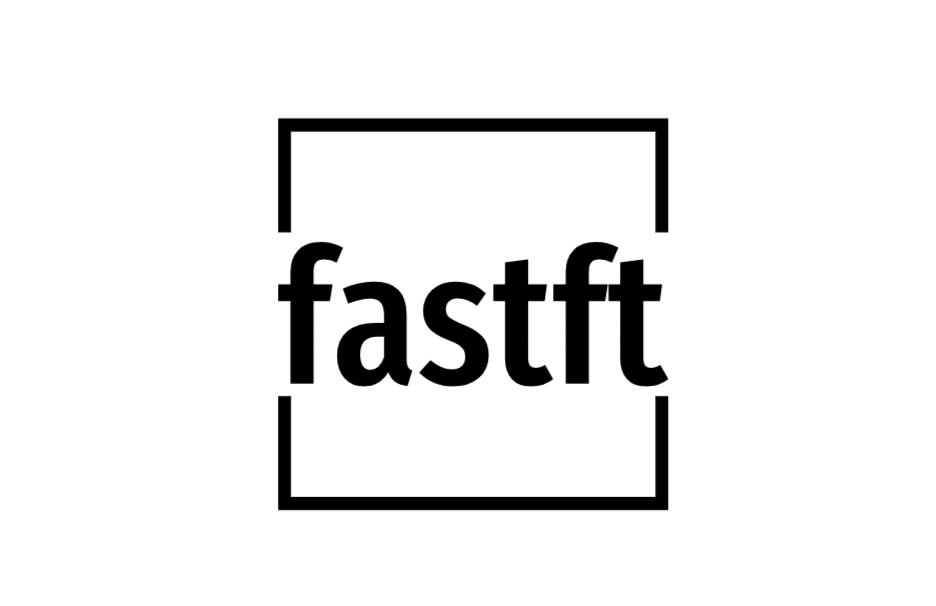

**Fastft**: **Fa**st **S**hort **T**ime **F**ourrier **T**ransform implementation based on **F**astest **F**ourier **T**ransform in the **W**est (**FFTW**).


# Motivation

The Short Time Fourier Transform (STFT) is a common tool in audio AI tasks. However, there is currently no standard implementation in C that facilitates fast and efficient features extraction for the purpose of inference. **Fastft** aims to address this gap by offering an implementation based on the Fastest Fourier Transform in the West (FFTW). This implementation is suitable for Spectrogram/STFT-based inference (e.g., models like [Spleeter](https://github.com/deezer/spleeter), [MOSnet](https://github.com/lochenchou/MOSNet), etc.), and it can also be extended to cover feature extraction algorithms such as MFCC. The implementation aims to be as efficient as possible in order to target CPU-based low-latency inference solutions. 

While some deep learning libraries offer the option of incorporating STFT into the model, these implementations **often differ** and **may restrict developer flexibility**; two critical considerations when targeting embedded hardware.


# Project structure

The following is an illustration of the different components of the project.

```

├── CMakeLists.txt
├── comparison                            # compare Librosa.stft to Fastft
│   ├── _create_audio.py
│   ├── _plot_spectrograms.py
│   └── README.md
├── docs                                  # project documentation
├── extras                                # extra resources
│   └── logo.png
├── include
│   ├── pad.h
│   ├── signal.h
│   ├── spectral.h
│   ├── trafo_istft.h
│   ├── trafo_stft.h
│   └── window.h
├── README.md
├── resources
│   └── chirp.wav
├── src
│   ├── pad.c
│   ├── signal.c
│   ├── spectral.c
│   ├── trafo_istft.c
│   ├── trafo_stft.c
│   └── window.c
└── test                                 # gtests folder
    ├── CMakeLists.txt
    ├── main.cpp
    └── test_stft.cpp


```