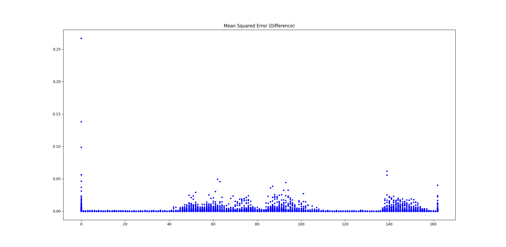

# Introduction

This folder will include the python scripts/ code needed to compare the output of fastft and [librosa](https://librosa.org/doc/latest/index.html) specifically it [STFT](https://librosa.org/doc/main/generated/librosa.stft.html) implementation.


## Project Structure

The project structure is as follows (when the depedencies are installed):

```
├── benchmark.py
├── build
│   ├── build.ninja
│   ├── CMakeCache.txt
│   ├── CMakeFiles
│   ├── cmake_install.cmake
│   ├── compile_commands.json
│   ├── external
│   ├── fastft_stft
│   ├── fastft_stft.csv
│   └── sndfile_signal.csv
├── CMakeLists.txt
├── external
│   └── fastft
├── main.cpp
├── README.md
└── requirements.txt
```
# Dependencies 
Before building the project you need to download & place the following libraries under the `external/` folder: 

- [fastft](https://github.com/SuperKogito/fastft)

## Build
To build the C++ comparison code that generates the fastft STFT, you should do the following: 

```
mkdir build
cd build
cmake ..
make
```


To build the Python code you will need first to install the requirements:

```
pip install -r requirements.txt
```


## Usage 
1. Run the CLI with the path to the WAV file to generate the STFT and signal CSV files:

```
Usage: ./fast_stft <wav_fpath>
  <wav_fpath>  : Path to the WAV file
```

2. Run the python benchmark to compare the results to librosa results.
```
python benchmark.py
```

# Results
The code confirms that fastft is a great approximation of librosa in C. This is seen in the plots as well as the logs.
 


```
- len(librosa-sig) ? len(snd-sig) :  41610 41610
- librosa-sig      ? sndfile-sig  :  True
- librosa-sig      - sndfile-sig  :  8.316473590729898e-14
- fastft STFT shape               :  (163, 257)
- librosa STFT shape              :  (163, 257)
- MSE(fastft_stft, librosa_stft)  :  0.00037213606836944727
```

## License

This project is licensed under the BSD 3-Clause License. See the [LICENSE](https://github.com/SuperKogito/fastft/blob/master/LICENSE) file for details.
